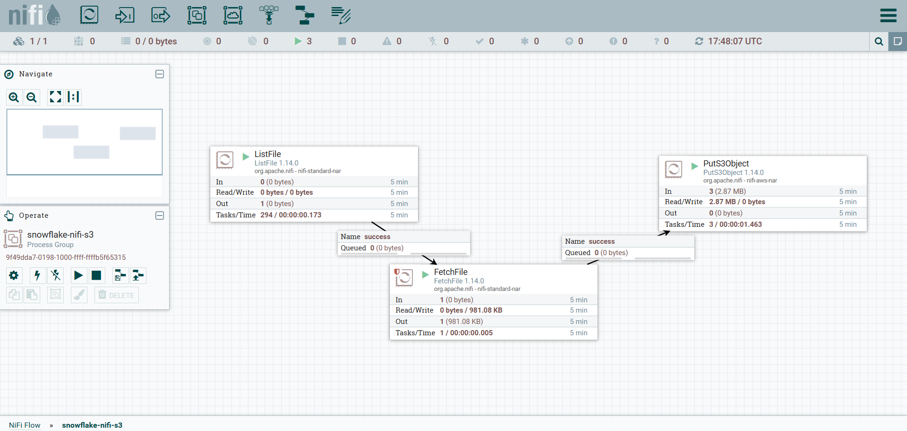

# Project 2 – Real-Time Data Pipeline with AWS EC2, Docker, Apache NiFi, and Snowflake (SCD2)

## 📌 Overview

This project demonstrates the setup and implementation of a **real-time-inspired** data pipeline using AWS EC2, Docker, Apache NiFi, and Snowflake with **Slowly Changing Dimension Type 2 (SCD2)** logic.  
Since real-time streaming data was unavailable, synthetic customer data was generated using the `Faker` library and processed end-to-end, from ingestion to warehousing.

---

## 🚀 Architecture & Workflow

1. **Infrastructure Setup**

   - Created an **AWS EC2** instance as the environment for running Docker containers.
   - Installed Docker and Python (via pip) on the EC2 instance.

2. **Service Deployment**

   - Configured **JupyterLab**, **Apache NiFi**, and **Zookeeper** using `docker-compose.yaml`.
   - Deployed services by transferring and running the Docker Compose file on EC2.

3. **Data Generation**

   - Used the Python `Faker` library inside JupyterLab to generate synthetic **customer data**.

4. **Data Ingestion**

   - Apache NiFi **Processor Group**:
     - **List objects**
     - **Fetch objects**
     - **Upload to Amazon S3 bucket**

5. **Data Warehousing & Processing**
   - Created **tables** and **streams** in **Snowflake**.
   - Implemented **Slowly Changing Dimension Type 2 (SCD2)** on the main `customer` table.
   - Automated incremental updates with:
     - **Stored procedures**
     - **Streams**
     - **Tasks** for scheduled runs

---

## 📈 NiFi Flow Diagram

---

## 🛠️ Tech Stack

- **Cloud**: AWS EC2, Amazon S3
- **Containerization**: Docker, Docker Compose
- **Orchestration & Data Flow**: Apache NiFi, Zookeeper
- **Programming & Data Generation**: Python, Faker
- **Data Warehouse**: Snowflake (SCD2 implementation)
- **Development Environment**: JupyterLab

---

## 📜 Certificates

You can view my related certification [here](certificate/snowflake_cert.pdf).

## 👤 Author

- Varun Kumar Kolloju

## 📜 License

This project is licensed under **All Rights Reserved**. See the [LICENSE](LICENSE) file for details.
